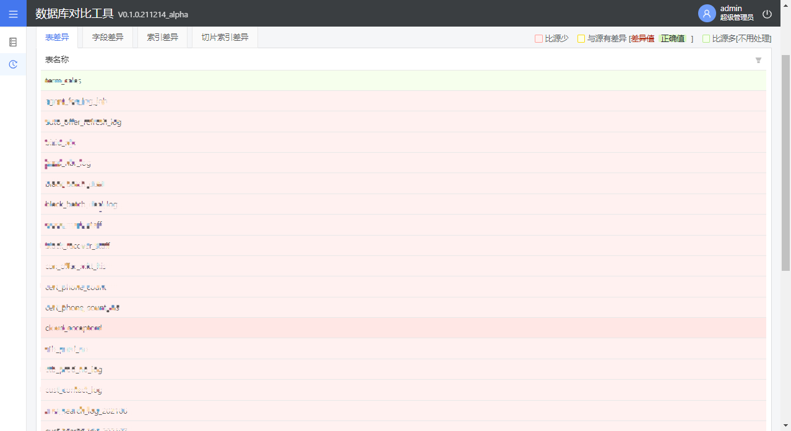
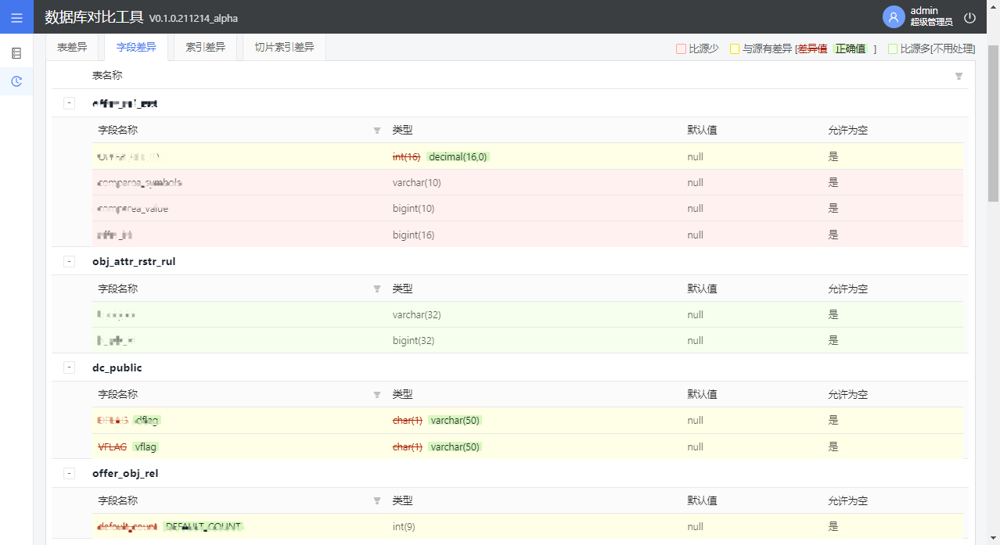

## 👉** 功能描述 **
> 1. **支持多数据库** ：mysql oracle DDL 两数据库的对比
> 2. **前后一体** ：前端react 后端springboot
> 3. **sqlite数据库** ：离线式数据库
> 4. **应用相似度算法** ：比对应用Jaccard算法
> 5. **登录鉴权** ：springsecurity
> 6. **excel导入导出** ：poi
> 7. **websocket** ：动态展示处理过程

## 👇功能使用
> 1. **登录** 
> 2. **数据库设置** 
> 3. **比对结果** 

## 🔥下载地址 
链接 [下载地址](https://github.com/sguo2017/DataCompare/blob/main/media/release/sqldelta-web-V0.1.0.211214_alpha.jar)

## 🙉联系我

欢迎添加我的微信（备注“Github”即可）。

